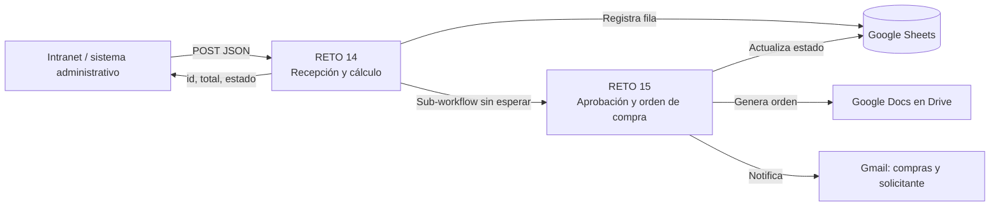
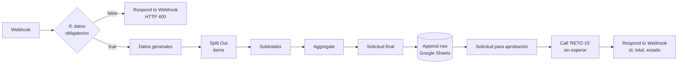
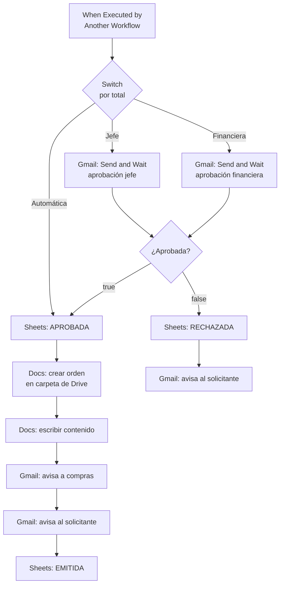

# Retos 11 al 20 · Automatización con n8n


Colección de **10 workflows de n8n** (Retos 11 al 20) desarrollados para el taller de automatización con IA. Incluye integración con Google Sheets, Docs, Drive y Gmail, webhooks, sub-workflows y flujos de aprobación humana.

## 🎥 Videos: ejecución, exposición y explicación de cada flujo

> **[▶ Ver los videos en Google Drive](PEGAR_AQUI_EL_ENLACE_DE_DRIVE)**

Cada video muestra la pantalla y el rostro durante la presentación, con la ejecución del flujo, su exposición y la explicación de cada nodo.

## 📑 Contenido

- [Flujos incluidos](#-flujos-incluidos)
- [Retos 14 y 15: Sistema de solicitudes de compra](#-retos-14-y-15-sistema-de-solicitudes-de-compra)
- [Taller 3: Retos 16 al 20](#️-taller-3-retos-16-al-20-automatizaciones-operables)
- [Cómo importar los workflows](#-cómo-importar-los-workflows)
- [Requisitos](#-requisitos)
- [Notas de seguridad](#-notas-de-seguridad)

## 🧩 Flujos incluidos

| Reto | Estado | Archivo | Descripción |
|------|:------:|---------|-------------|
| 11 | ✅ | `reto-11-....json` | _Completar: qué hace en una línea_ |
| 12 | ✅ | `reto-12-....json` | _Completar_ |
| 13 | ✅ | `reto-13-....json` | _Completar_ |
| 14 | ✅ | `reto-14-recepcion-solicitudes.json` | Recibe solicitudes de compra por webhook, valida, calcula subtotales y total, registra en Sheets y llama al Reto 15 |
| 15 | ✅ | `reto-15-aprobacion-orden-compra.json` | Aprobación por niveles, orden de compra en Google Docs y notificaciones por correo |
| 16 | ⏳ | `reto-16-control-calidad-clientes.json` | Clasifica registros de clientes como válidos, en revisión, rechazados o duplicados y los enruta a maestro o cuarentena |
| 17 | ⏳ | `reto-17-informe-ejecutivo-diario.json` | Consolida ventas, soporte y operaciones en un informe diario con resumen de IA |
| 18 | ⏳ | `reto-18-monitoreo-errores.json` | Centraliza los errores de otros workflows, alerta y evita alertas repetidas |
| 19 | ⏳ | `reto-19-registro-incidentes.json` | Registra incidentes por HTTP, espera el SLA y escala si siguen abiertos |
| 20 | ⏳ | `reto-20-motor-escalamiento.json` | Escala incidentes vencidos hasta el nivel 3 con canales según severidad |

✅ implementado y probado · ⏳ pendiente de implementar

## 🛒 Retos 14 y 15: Sistema de solicitudes de compra

Los dos retos forman **una única solución corporativa** compuesta por **dos workflows independientes**. La aplicación que origina la solicitud no es n8n: una intranet o sistema administrativo envía la información por HTTP.



La decisión de diseño clave es que **el Reto 14 no se bloquea esperando la aprobación**. Entrega la solicitud al Reto 15 y responde de inmediato, porque una persona puede tardar horas en aprobar.

### Reto 14: Recepción y cálculo de solicitudes

**Entrada** (`POST /webhook/solicitud-compra`):

```json
{
  "solicitante": "Laura Gómez",
  "correo": "laura@empresa.com",
  "centro_costo": "TECNOLOGIA",
  "justificacion": "Renovación de equipos",
  "items": [
    { "descripcion": "Monitor 27 pulgadas", "cantidad": 3, "valor_unitario": 950000 },
    { "descripcion": "Dock USB-C", "cantidad": 3, "valor_unitario": 350000 }
  ]
}
```

**Respuesta correcta** (`200`):

```json
{
  "id_solicitud": "SOL-20260928-170557-362",
  "total": 3900000,
  "estado": "PENDIENTE_APROBACION"
}
```

**Respuesta ante una solicitud inválida** (`400`): no continúa al proceso de aprobación.

```json
{ "error": "Faltan datos obligatorios: solicitante, correo, centro_costo o items" }
```



| Nodo | Función |
|------|---------|
| **Webhook** | Recibe el `POST` de la aplicación corporativa. |
| **If** | Valida que existan `solicitante`, `correo`, `centro_costo` e `items`. |
| **Respond to Webhook** (rama falsa) | Devuelve el error HTTP 400 y termina. |
| **Datos generales** | Crea el ID único `SOL-AAAAMMDD-HHMMSS-NNN` y fija el estado `PENDIENTE_APROBACION`. |
| **Split Out** | Separa el arreglo `items` para procesar cualquier cantidad de productos. |
| **Subtotales** | Calcula `cantidad × valor_unitario` de cada ítem, sin valores escritos a mano. |
| **Aggregate** | Reagrupa los ítems ya calculados. |
| **Solicitud final** | Calcula el total general a partir de los subtotales. |
| **Append row in sheet** | Registra **una sola fila** por solicitud, conservando el detalle de los productos. |
| **Solicitud para aprobación** | Prepara el paquete que recibe el Reto 15. |
| **Call 'RETO 15'** | Ejecuta el sub-workflow con _Wait For Sub-Workflow Completion_ desactivado. |
| **Respond to Webhook** (final) | Responde a la aplicación con el ID, el total y el estado. |

### Reto 15: Aprobación y emisión de orden de compra

Este workflow **no lo inicia el usuario**: arranca con _When Executed by Another Workflow_ y recibe la solicitud procesada por el Reto 14.

**Política de aprobación** (los umbrales son configurables en el nodo Switch):

| Nivel | Condición sobre el total | Qué ocurre |
|-------|--------------------------|------------|
| Automática | menor a 1.000.000 | Se aprueba sin intervención humana. |
| Jefe | de 1.000.000 a menos de 5.000.000 | Correo de aprobación al jefe. |
| Financiera | 5.000.000 o más | Correo de aprobación al área financiera. |



**La orden de compra incluye:** número/ID de solicitud, fecha, solicitante, centro de costo, justificación, detalle de ítems, total y nivel de aprobación. Se guarda en una carpeta específica de Google Drive.

**Estados de la solicitud en Google Sheets:**

`PENDIENTE_APROBACION` → `APROBADA` → `EMITIDA`  
`PENDIENTE_APROBACION` → `RECHAZADA`

### Pruebas realizadas

| Caso | Resultado esperado | Verificado |
|------|--------------------|:----------:|
| Solicitud válida | Respuesta inmediata con ID, total y estado | ✅ |
| Solicitud sin campos obligatorios | HTTP 400 y no llega al Reto 15 | ✅ |
| Total en nivel Automática | Sin correo de aprobación; orden emitida | ✅ |
| Total en nivel Jefe, aprobado | Orden en Docs, correos y estado `EMITIDA` | ✅ |
| Total en nivel Financiera, aprobado | Orden en Docs, correos y estado `EMITIDA` | ✅ |
| Rechazo | Estado `RECHAZADA`, correo al solicitante, sin orden | ✅ |

**Prueba rápida con PowerShell:**

```powershell
$body = @'
{"solicitante":"Laura Gómez","correo":"laura@empresa.com","centro_costo":"TECNOLOGIA","justificacion":"Renovación de equipos","items":[{"descripcion":"Monitor 27 pulgadas","cantidad":3,"valor_unitario":950000},{"descripcion":"Dock USB-C","cantidad":3,"valor_unitario":350000}]}
'@
Invoke-RestMethod -Method Post -Uri "https://TU-DOMINIO/webhook/solicitud-compra" -ContentType "application/json; charset=utf-8" -Body ([System.Text.Encoding]::UTF8.GetBytes($body)) | ConvertTo-Json
```

## 🛠️ Taller 3: Retos 16 al 20 (automatizaciones operables)

En este taller un workflow no se considera terminado solo porque ejecuta una vez. Debe responder correctamente ante datos incompletos, ausencia de información, duplicados, fallos y cambios de estado. **Cada reto debe demostrar al menos un caso normal y un caso adverso, y explicar qué evita que el proceso se comporte incorrectamente.**

> **Estado:** ⏳ pendiente de implementar. Lo que sigue describe lo que pide cada reto y el diseño previsto. Se actualizará cuando cada flujo esté hecho y probado.

### Reto 16: Control de calidad de clientes

**Qué pide:** una base comercial recibe registros con nombre, apellido, email, teléfono, empresa, NIT, ciudad y fecha. Cada registro se clasifica como `VALIDO`, `REQUIERE_REVISION`, `RECHAZADO` o `DUPLICADO`. Los válidos pasan a `Clientes_Maestro` y los demás a `Clientes_Cuarentena`, con el motivo.

**Reglas mínimas:** nombre, email, empresa y NIT obligatorios; email con estructura válida; teléfono de al menos 10 dígitos; normalizar espacios y mayúsculas del email; un email que ya existe en el maestro es un duplicado.

**Diseño previsto:** Google Sheets Trigger (fila nueva), normalización con Edit Fields, validación con expresiones y condiciones (sin IA), búsqueda del email en el maestro, enrutamiento con Switch, Merge de las ramas y escritura en la hoja de destino.

**Qué evita el error:** una sola hoja de cuarentena con una columna de motivo (no una hoja por error), y los emails salen siempre de los datos de entrada, sin valores escritos en el workflow.

**Casos a demostrar:** registro completo (pasa al maestro) y registro con email repetido o sin NIT (va a cuarentena con su motivo).

### Reto 17: Informe ejecutivo diario

**Qué pide:** consolidar `Ventas`, `Soporte` y `Operaciones` en un único informe diario con valor de ventas, negocios cerrados, tickets abiertos, cerrados y vencidos, y procesos ejecutados y fallidos. Un modelo de IA interpreta los KPIs y entrega resumen ejecutivo, riesgos y temas de atención. Se envía un único correo y se registra el informe.

**Diseño previsto:** Schedule Trigger diario, lectura filtrada de las tres fuentes, agregación por fuente, Merge con múltiples entradas, cálculo de los KPIs con expresiones, HTTP Request al modelo de IA, un solo Gmail y registro en Sheets.

**Qué evita el error:** las cifras las calcula el workflow y la IA solo las interpreta. Una fuente sin filas aporta cero en lugar de detener el flujo, y se envía un solo correo en vez de tres.

**Casos a demostrar:** día con datos en las tres fuentes y día en que una fuente está vacía.

### Reto 18: Centro de monitoreo de errores

**Qué pide:** un proceso central que recibe los errores de otros workflows y registra fecha, workflow, workflow ID, execution ID, último nodo, mensaje y URL de ejecución cuando exista. Genera una alerta inmediata y reduce las alertas idénticas repetidas del mismo error.

**Diseño previsto:** workflow con Error Trigger configurado como _error workflow_ de los demás flujos, Edit Fields para armar el registro, comprobación contra los errores ya registrados para detectar repetidos, registro en Sheets y alerta solo cuando el error es nuevo.

**Qué evita el error:** no hay una notificación de error dentro de cada workflow, todo pasa por el flujo central. La prueba se hace con una ejecución real fallida y no solo con ejecución manual.

**Casos a demostrar:** un error nuevo (genera alerta) y el mismo error repetido (se registra sin volver a alertar).

### Reto 19: Registro y seguimiento de incidentes

**Qué pide:** una aplicación envía incidentes por HTTP con título, descripción, impacto (`CRITICO`, `ALTO`, `MEDIO`, `BAJO`) y `reportado_por`. El sistema genera un ID, consulta el SLA en una configuración, registra el incidente, responde a la aplicación, espera el SLA, vuelve a consultar el estado y, si sigue abierto, lo envía al motor de escalamiento.

**Diseño previsto:** Webhook, generación del ID, lookup del SLA en una hoja de configuración, registro, Respond to Webhook, nodo Wait durante el SLA, nueva consulta del estado y llamada al Reto 20 como sub-workflow si sigue abierto.

**Qué evita el error:** no hay un Schedule que revise todos los incidentes cada minuto ni bucles activos durante el SLA, y los tiempos de SLA viven en un solo lugar.

**Casos a demostrar:** incidente que se cierra antes del SLA (no escala) e incidente que sigue abierto (pasa al Reto 20).

### Reto 20: Motor de escalamiento

**Qué pide:** recibe incidentes vencidos y considera por separado `impacto` y `nivel_escalamiento`. El primer vencimiento es el nivel 1, si continúa abierto el nivel 2 y luego el nivel 3, sin superar nunca el nivel 3. Registra incidente, impacto, nivel, fecha, canales, destinatarios, estado previo y nuevo, y motivo. Los casos más severos usan más canales.

**Diseño previsto:** When Executed by Another Workflow, lectura del nivel actual, cálculo del siguiente nivel con tope en 3, selección de canales y destinatarios según impacto y nivel, actualización de la fila, registro de la acción y reejecución controlada mientras el incidente siga abierto y el nivel sea menor a 3.

**Qué evita el error:** un único workflow para todas las prioridades, impacto y nivel guardados como datos distintos, y un tope explícito que impide el escalamiento infinito.

**Casos a demostrar:** incidente crítico que llega al nivel 3 con más canales, y comprobación de que un incidente en nivel 3 no sube más.

## 📥 Cómo importar los workflows

1. En n8n, ve a **Workflows → Import from file** y elige un `.json` de este repositorio.
2. **Reconecta las credenciales** de Google (Sheets, Docs, Drive y Gmail), porque los archivos no las incluyen.
3. Ajusta el **documento y la hoja** de Google Sheets, y la **carpeta de Drive** de las órdenes de compra.
4. **Reto 14:** en el nodo _Call 'RETO 15'_, vuelve a seleccionar el workflow del Reto 15 (se referencia por ID y cambia en cada instancia). Importa y publica primero el Reto 15.
5. **Reto 15:** cambia los correos de jefe, financiera y compras por los reales.
6. Publica los workflows y usa la URL de producción del webhook (`/webhook/...`, no `/webhook-test/...`).

## ⚙️ Requisitos

- n8n (cloud o autoalojado) con un dominio o túnel público si el webhook será llamado desde fuera.
- Cuenta de Google con las APIs de **Sheets, Docs, Drive y Gmail** habilitadas en Google Cloud.
- Una hoja de cálculo con las columnas de la solicitud, incluido el detalle de ítems y el estado.

## 🔐 Notas de seguridad

- Los JSON exportados **no contienen secretos**, pero sí correos, IDs de hojas y carpetas, y la URL del webhook. Revísalos antes de publicar el repositorio.
- No subas credenciales, tokens ni claves de API.
- En producción, protege el webhook con autenticación (header o token) para que solo la intranet pueda llamarlo.

---

**Autor:** MRF-DEV02 (Nicolas Fandiño) · Taller de Automatización con IA
